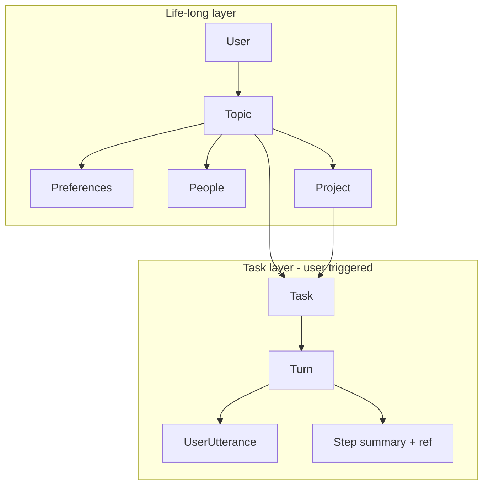

# Positioning: Structured Memory for Life-Long Helping Agents

## Contribution in one sentence

**Structured memory for life-long helping agents that (a) uses a native hierarchy (User → Topics with per-node preferences/people), (b) models agent execution as user-triggered (Turn → UserUtterance → Steps with summaries + refs), and (c) supports path/semantic retrieval and token-efficient "go back" to intermediate results.**

---

## Two-layer schema

The memory has two layers that are both native to the application:

1. **Life-long layer:** User's world over time — topics (or domains), with per-node slots for preferences, people/relationships, and projects.
2. **Task layer:** Execution of helping episodes — each **user utterance** triggers a **Turn**; under that Turn we store the UserUtterance (summary + ref) and the agent's **Steps** (reasoning, tool calls, results, message) as lightweight nodes with summaries and refs to full content.

Full content (long user messages, tool outputs) lives in a **content store**; the tree holds only summaries and refs so that retrieval is token-efficient and path/semantic queries apply to a stable schema.

---

## Relation to existing work

### Memory-R1 (Yan et al., 2025)

- **Them:** Flat memory bank; Memory Manager does ADD/UPDATE/DELETE over an unordered list; no explicit turn or user-trigger structure.
- **Us:** We add **structure** (tree over topics, projects, tasks) and **user-triggered** turns (Turn → UserUtterance → Steps). Task-level steps carry summaries + refs for token-efficient trace/track and "go back."

### Semantic XPath (Liu et al., 2026)

- **Them:** Read-only XPath-style queries over domain trees (e.g. Itinerary → Day → POI); no life-long layer, no task-level execution, no ref-based content store.
- **Us:** We extend to **life-long** (topics, preferences, people) and **task-level** (turns, user utterances, steps with refs). Same path/semantic retrieval idea, applied to a broader schema and with writes (ADD/UPDATE/DELETE) and ref resolution.

### Mem0 / flat RAG

- **Them:** Persistent or static flat store; semantic search (embeddings, top-k); optional dynamic update; no native hierarchy or path-based access.
- **Us:** **Native schema** (topics, tasks, turns, steps) and **path-based retrieval**; content store + refs for token efficiency; explicit user-triggered turn structure.

### Generative Agents (Park et al., 2023) / SGMem

- **Them:** Memory stream + reflection, or sentence-level graphs over turn/round/session; no formal two-layer tree (life-long + task) or ref-based step storage.
- **Us:** **Formal tree** (life-long + task layer) and **task-level** structure (Turn, UserUtterance, Step with refs). Reflection/consolidation can be modeled as updates to the life-long layer (e.g. preferences, outcomes) rather than a separate stream.

### TME / AriGraph / Optimus-1

- **Them:** Task memory trees or knowledge graphs; step I/O or episodic graphs; multimodal or environment-focused. Not centered on user utterance as trigger or on life-long topic/preference/people layer.
- **Us:** **User utterance as trigger** (Turn → UserUtterance → Steps) and **token efficiency** (summaries + refs). We emphasize life-long helping (topics, preferences, people) plus task-level trace/track, not only task DAGs or world-model graphs.

---

## Why this positioning works for NeurIPS

- **Problem:** Life-long helping agents need durable, structured memory that supports both (1) user-level context (topics, preferences, people) and (2) task-level trace (what the user said, what the agent did, where we are) with token-efficient access.
- **Gap:** Flat and graph-based memory do not give a single native schema for both layers; read-only structured access (e.g. Semantic XPath) does not model task execution or refs; task/graph memories often do not model user-triggered turns or life-long scope.
- **Contribution:** A single **native two-layer structured memory** (life-long + user-triggered task) with **path/semantic retrieval** and **ref-based** access to intermediate results, with clear formalization and baseline comparisons on long-term and (optionally) agentic benchmarks.

See [related_work.md](related_work.md) for detailed related work and [baselines.md](baselines.md) for the comparison table.
